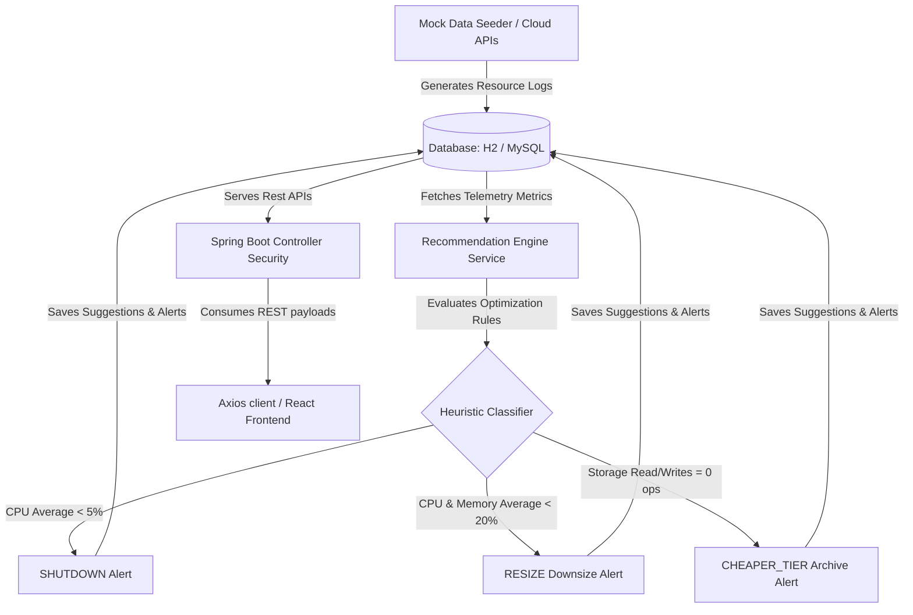

# ☁️ CloudCost - Premium Cloud Cost Optimization Dashboard

[](https://openjdk.org/)
[](https://spring.io/projects/spring-boot)
[](https://react.dev/)
[](https://vitejs.dev/)
[](https://www.mysql.com/)
[](https://www.docker.com/)

A premium, full-stack multi-cloud cost aggregation, analysis, and optimization dashboard providing resource-level analytics and actionable cost-saving recommendations.

---

## 🔍 1. Project Overview & Problem Solved

Managing cloud spend across multiple providers (AWS, Azure, GCP) is complex, often leading to wasted budget on underutilized or orphaned infrastructure. **CloudCost** solves this problem by consolidating multi-cloud resource inventories into a single, cohesive pane of glass. It actively monitors resource usage telemetry and applies customizable heuristic optimization rules to identify idle compute units, oversized database nodes, and unused storage blocks, helping engineering and finance teams eliminate up to 70% of waste.

---

## ✨ 2. Key Features

*   **🔐 Secure JWT Authentication**: Full register and login flow using industry-standard JSON Web Token authentication with custom interceptors to automatically refresh sessions.
*   **🌐 Multi-Cloud Monitoring**: Unified analytics tracking across AWS, Microsoft Azure, and GCP resources.
*   **⚙️ Resource Analysis Engine**: Telemetry tracking system analyzing CPU, Memory, and storage read/write performance patterns.
*   **💡 Intelligent Cost Recommendations**: Automatic recommendations (Shutdown, Resize, Archive/Cheaper Tier) to address cloud resource waste.
*   **📈 30-Day Predictive Forecasting**: Machine-learning-based linear regression curves comparing standard expenditure versus optimized spend levels over the next month.
*   **🔔 Real-Time Notifications**: Visual badge updates and alert logs triggered dynamically when underutilized resources are registered.
*   **➕ Manual Resource Entry**: An interactive modal form letting administrators input live instance metrics and run instant optimization analysis.
*   **🐳 Docker Orchestration**: One-click containerized deployment setup running frontend and backend in isolated bridge networks.

---

## 🛠️ 3. Tech Stack

| Layer | Technology | Purpose |
| :--- | :--- | :--- |
| **Frontend** | React 18, Vite, Tailwind CSS, Recharts, Lucide Icons | Responsive UI, high-performance compilation, and SVG cost graphing |
| **Backend** | Java 17, Spring Boot 3.2.5, Spring Security, JPA | REST APIs, token filtering, scheduling, and core analytics |
| **Database** | H2 (Local Development), MySQL 8.0 (Production) | Persistent storage for users, metrics, and resources |
| **Authentication** | JSON Web Tokens (JJWT), BCrypt Encryption | Secure session validation and password hashing |
| **Cloud SDKs** | AWS SDK (v2), Azure Resource Manager, GCP Billing | Native API connections for real-time cloud inventory syncing |
| **Containerization** | Docker, Docker Compose | Consistent local build orchestration |

---

## 📁 4. Project Structure

The project is split into a standalone React frontend client and a Maven-built Spring Boot backend API:

```text
MARK 1/
├── .github/                   # GitHub configurations
│   └── modernize/             # Modernization and build hooks
├── .vscode/                   # Workspace-specific editor configurations
├── backend/                   # Spring Boot Backend application
│   ├── pom.xml                # Maven project configuration and dependencies
│   ├── run.bat                # Batch file to start the Spring Boot app locally
│   └── src/main/java/com/cloudcostdashboard/
│       ├── CloudCostDashboardApplication.java # Spring Boot entrypoint class
│       ├── config/            # Security and app configuration files
│       │   └── SecurityConfig.java            # Spring Security and CORS setup
│       ├── controller/        # REST controllers exposing API endpoints
│       │   ├── AuthController.java            # Registration & Login endpoints
│       │   ├── CloudResourceController.java   # Fetch & manually add resources
│       │   ├── CostController.java            # Cost records, summary, and forecasting
│       │   ├── NotificationController.java    # Read and clear optimization alerts
│       │   └── RecommendationController.java  # View and apply recommendations
│       ├── dto/               # Data Transfer Objects for API payloads
│       ├── entity/            # JPA Entity models representing database tables
│       ├── repository/        # Spring Data JPA repositories interfacing with the DB
│       ├── security/          # JWT filter, custom user details, token provider
│       └── service/           # Business logic, scheduling, and analytics engines
│           ├── AwsCostService.java            # Connects to real AWS APIs
│           ├── AzureCostService.java          # Connects to real Azure APIs
│           ├── GcpCostService.java            # Connects to real GCP APIs
│           ├── MockDataGeneratorService.java  # Populates mock data for local demos
│           ├── NotificationService.java       # Manages in-app user notifications
│           ├── RecommendationEngineService.java # Heuristic rules & cost forecasting engine
│           └── SchedulerService.java          # Background cron jobs for metric refreshes
├── frontend/                  # React + Vite Frontend application
│   ├── Dockerfile             # Container configuration for frontend
│   ├── package.json           # Node.js project manifests and script definitions
│   ├── postcss.config.js      # Tailwind CSS configuration
│   ├── tailwind.config.js     # Tailwind design system configurations
│   ├── vite.config.js         # Vite configuration with API routing proxy
│   └── src/
│       ├── App.jsx            # Main app router mapping page views
│       ├── index.css          # Core CSS stylesheet housing styling systems
│       ├── main.jsx           # React app entry point mounting the root DOM
│       ├── components/        # Reusable dashboard widgets & modals
│       │   ├── AddResourceModal.jsx    # Modal form to register new cloud nodes
│       │   ├── DashboardLayout.jsx     # Side menu, notifications & profile shell
│       │   ├── KpiCard.jsx             # Metric container for total stats
│       │   ├── RecommendationCard.jsx  # Actionable card for optimization advice
│       │   ├── ResourceTable.jsx       # Grid list showing resources with action items
│       │   └── SpendForecastChart.jsx  # Recharts implementation for cost curves
│       ├── context/           # React Context providers for global state
│       │   ├── AuthContext.jsx         # Manages logged-in session state
│       │   └── NotificationContext.jsx # Subscribes to real-time notification alerts
│       ├── pages/             # Dashboard full-page layouts
│       │   ├── Dashboard.jsx           # Main stats & charts overview page
│       │   ├── Login.jsx               # Login landing page
│       │   ├── Signup.jsx              # Signup page
│       │   ├── Recommendations.jsx     # Full optimization suggestions view
│       │   └── Resources.jsx           # Master table view for all assets
│       └── services/          # API calling clients
│           └── api.js                  # Axios client with JWT interceptor configuration
├── docker-compose.yml         # Local Docker Orchestration file
└── README.md                  # Comprehensive project documentation
```

---

## 🚀 5. Getting Started (How to Run)

### 📋 Prerequisites
Make sure the following are installed locally:
*   **Java 17 JDK** or higher
*   **Node.js 18.x** or higher
*   **Docker Desktop** (for containerized deployments)
*   **Maven 3.8+** (if compiling the Java app without Docker)

---

### 🐳 Option A: Multi-Container Deployment (Recommended)
You can build and deploy the entire stack using Docker Compose:

1. Clone this repository and open the workspace.
2. In the project root directory, run:
   ```bash
   docker-compose up --build
   ```
3. Docker will build the React bundle and launch the Spring Boot API inside containers.
4. Access the web interface at `http://localhost:3000`.

---

### 💻 Option B: Running Locally (Without Docker)

#### 1. Backend Launch
1. Ensure your local database is available (or use the automatic H2 fallback).
2. Move into the backend directory:
   ```bash
   cd backend
   ```
3. Run the application:
   ```bash
   mvn spring-boot:run
   ```
   *The API will start listening at `http://localhost:8080`.*

#### 2. Frontend Launch
1. Open a new terminal in the frontend directory:
   ```bash
   cd frontend
   ```
2. Install npm dependencies:
   ```bash
   npm install
   ```
3. Launch the development server:
   ```bash
   npm run dev
   ```
   *The client will start listening at `http://localhost:3000` and proxy all API calls dynamically.*

---

### 🛠️ Running with Mock Data Mode
If real cloud SDK connections are not configured, you can enable Mock Data generation. To enable this, ensure the following property is set in the environment or inside [application.properties](file:///c:/Users/karis/OneDrive/Desktop/MARK%201/backend/src/main/resources/application.properties):

```properties
app.use-mock-data=true
```
When set to `true`, the application will automatically populate the local database with rich virtual inventories, daily billing transactions, and optimization flags on system startup.

---

## ⚙️ 6. Environment Variables Reference

| Variable / Property | Default Value | Location | Description |
| :--- | :--- | :--- | :--- |
| `spring.datasource.url` | `jdbc:mysql://localhost:3306/...` | `application.properties` | Connection url for your database (MySQL/H2) |
| `spring.datasource.username` | `root` | `application.properties` | Database login username |
| `spring.datasource.password` | `Karishm@08` | `application.properties` | Database login credentials password |
| `app.jwt.secret` | `3cfa76f4e15647a7f45b53e7f45...` | `application.properties` | Secret signature key for JWT authentication |
| `app.use-mock-data` | `true` | `application.properties` | Enables dynamic mock telemetry data seeding |
| `app.cors.allowed-origins` | `http://localhost:5173,http://localhost:3000` | `application.properties` | Access control headers configurations |

---

## 🔌 7. API Endpoints Reference

All endpoints (excluding Auth routes) require a bearer token header: `Authorization: Bearer <jwt_token>`.

### 🔑 Authentication (`/api/auth`)
| Method | URL | Auth Required | Description |
| :--- | :--- | :--- | :--- |
| **POST** | `/register` | No | Creates a new user profile in the database |
| **POST** | `/login` | No | Validates credentials and yields a session JWT |

### 🖥️ Resource Management (`/api/resources`)
| Method | URL | Auth Required | Description |
| :--- | :--- | :--- | :--- |
| **GET** | `/` | Yes | Retrieves details of all managed resources |
| **GET** | `/{id}` | Yes | Retrieves metadata of a single resource |
| **POST** | `/` | Yes | Creates a manual resource and triggers immediate utilization analysis |

### 💵 Cost & Billing API (`/api/costs`)
| Method | URL | Auth Required | Description |
| :--- | :--- | :--- | :--- |
| **GET** | `/summary` | Yes | Yields run rates, overall spent values, and potential optimization savings |
| **GET** | `/records` | Yes | Queries daily itemized billing items (supports `provider` and date parameters) |
| **GET** | `/forecast` | Yes | Computes linear regressions and predicts next 30 days of spend |

### 💡 Optimization Recommendations (`/api/recommendations`)
| Method | URL | Auth Required | Description |
| :--- | :--- | :--- | :--- |
| **GET** | `/` | Yes | Lists optimization suggestions compiled by the telemetry engine |
| **POST** | `/{id}/apply` | Yes | Commits and applies recommendations, updating active resource configs |

### 🔔 System Alerts & Notifications (`/api/notifications`)
| Method | URL | Auth Required | Description |
| :--- | :--- | :--- | :--- |
| **GET** | `/` | Yes | Fetches list of all real-time in-app alerts |
| **POST** | `/{id}/read` | Yes | Marks a specific alert notification as read |
| **POST** | `/read-all` | Yes | Marks all notifications as read in bulk |

---

## 🧠 8. How It Works (Architecture & Heuristics)



### 📏 Heuristic Analysis Rules
The `RecommendationEngineService` analyzes active telemetry data points to classify resource efficiency:
1.  **Idle Instance Rule (`SHUTDOWN`)**:
    *   **Rule**: CPU utilization averages `< 5.0%` over a 7-day trailing window for `COMPUTE` resources.
    *   **Savings Calculation**: Saves `100%` of monthly cost (`costPerDay * 30`).
2.  **Over-Provisioned Rule (`RESIZE`)**:
    *   **Rule**: Both average CPU and Memory utilization remain `< 20.0%` over a 7-day window.
    *   **Savings Calculation**: Recommends downscaling to smaller sizes, saving `50%` of monthly cost (`costPerDay * 30 * 0.5`).
3.  **Unused Storage Rule (`CHEAPER_TIER`)**:
    *   **Rule**: `STORAGE` resource records `0` read/write operations over a 30-day window.
    *   **Savings Calculation**: Recommends migration to cold storage tier, saving `70%` of monthly cost (`costPerDay * 30 * 0.7`).

### 📉 Linear Regression Forecasting
The forecasting model fits a least-squares linear trend ($y = mx + c$) using 30 days of historical daily billing records. Using the calculated slope ($m$) and intercept ($c$), it projects daily expenditure over the next 30 days.

---

## 🖼️ 9. Screenshots (Placeholders)

*   **🔐 Login Page**: Clean layout for secure authentication.
*   **📊 Dashboard Overview**: Main dashboard containing KPI cards, active alerts, and cost forecasting curves.
*   **🖥️ Resource Table**: Inventory view displaying status badges and metadata.
*   **💡 Recommendations Panel**: Detailed view of optimization advice with buttons to instantly apply suggestions.
*   **🔔 Notification Bell**: In-app dropdown list showing recent cost-saving alerts.

---

## 🔮 10. Future Roadmap

*   **🛡️ Role-Based Access Control (RBAC)**: Fine-grained user access levels (Admin, Developer, Finance Auditor).
*   **🔌 Live Provider Integrations**: Full active API linking with live AWS, Azure, and GCP workspaces.
*   **📈 Smart Budgets**: Configurable budget thresholds with automated Webhook / email alert triggers.
*   **📑 Reporting & Exports**: Generate downloadable CSV summaries and PDF reports of cost savings.
*   **🧪 Suite Coverage**: Write extensive JUnit unit testing pipelines.
*   **📖 Open API Specs**: Swagger/OpenAPI documentation configurations.

---

## 👤 11. Author

*   **Name**: Karish Bhagavath M
*   **GitHub**: [github.com/Karish08](https://github.com/Karish08)
*   **LinkedIn**: [LinkedIn Profile](https://www.linkedin.com/in/karish-bhagavath-m-914b18205/)
